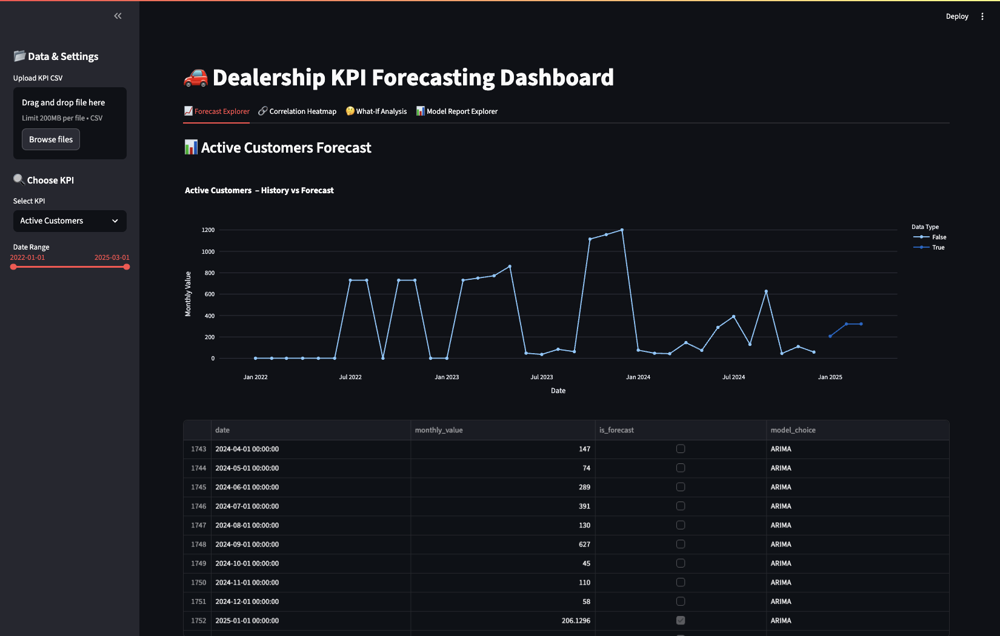
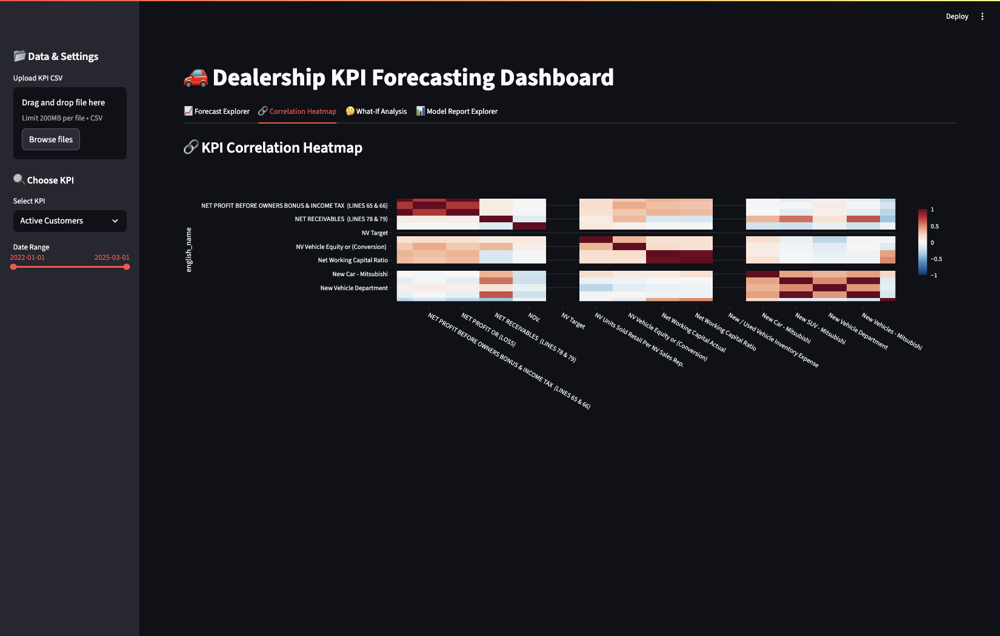
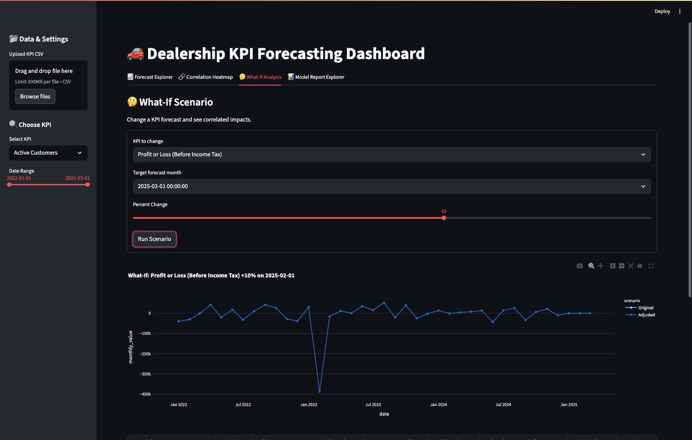
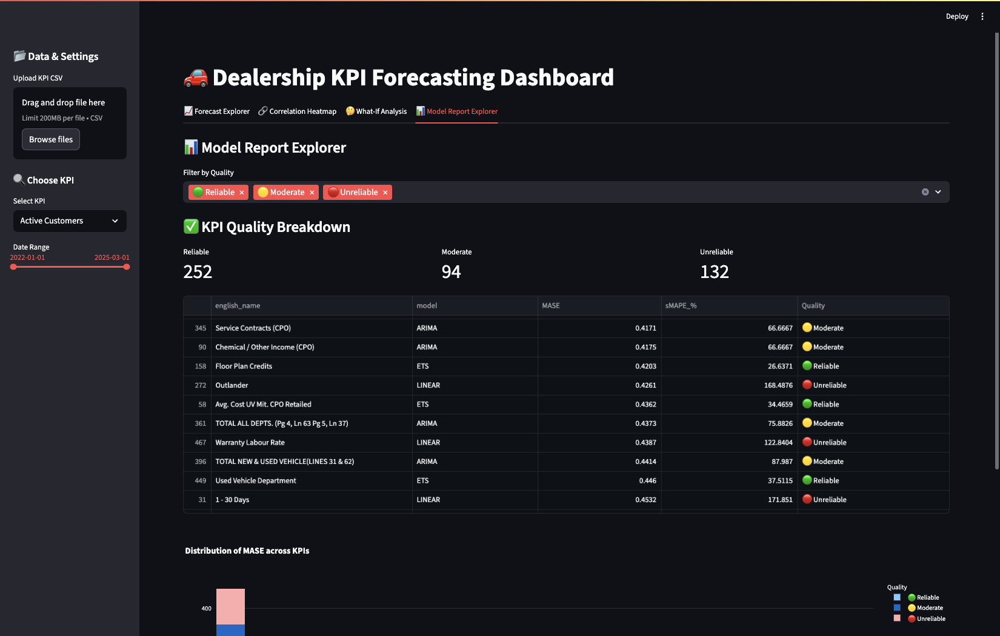

# 🚗 Dealership KPI Forecasting System

## 📋 Project Overview

This advanced KPI forecasting system provides comprehensive time series analysis and prediction capabilities for automotive dealership data. The system automatically selects the best forecasting model for each KPI, generates quality assessments, and provides an interactive dashboard for business intelligence.

---

## 📊 Forecast Explorer


---

## 🔗 Correlation Heatmap


---

## 🤔 What-If Analysis


---

## 📑 Model Report Explorer


### 🎯 Key Features

- **Multi-Model Forecasting**: ARIMA, ETS, Linear Regression, and Seasonal Naive models
- **Automatic Model Selection**: Cross-validation based selection for optimal performance
- **Quality Assessment**: Reliability scoring (🟢 Reliable, 🟡 Moderate, 🔴 Unreliable)
- **Interactive Dashboard**: Streamlit-based visualization and analysis tools
- **Correlation Analysis**: KPI relationship mapping and what-if scenario modeling
- **Business-Focused**: Whitelist of 20+ critical dealership KPIs

### 📊 Supported KPIs

**Sales KPIs:**
- TOTAL MITSUBISHI CARS RETAIL
- UV Units Sold Per NV & UV Sales Rep
- NV Units Sold, Used Vehicles - Retail
- NV/UV Gross Profit, Gross Profit (Total)

**Finance & Income:**
- Finance Income (New/Used/CPO)
- Service Contracts (CPO), Finance Penetration %

**Service & Parts:**
- Customer Pay Hours Sold, Warranty Hours Sold
- Service Revenue, Parts Revenue, Labour Sales Revenue

**Marketing & Customer:**
- Marketing Expense, Active Customers, Customer Retention %

**Overall Business:**
- Dept'l Operating Profit, Profit or Loss (Before Income Tax)

## 🛠 Installation

### Prerequisites
- Python 3.11+ (recommended for compatibility)
- pip package manager

### Setup Instructions

1. **Clone/Download the project:**
   ```bash
   cd "path/to/kpi-forecasting-advanced"
   ```

2. **Create virtual environment:**
   ```bash
   python -m venv .venv
   ```

3. **Activate virtual environment:**
   ```bash
   # macOS/Linux
   source .venv/bin/activate
   
   # Windows
   .venv\Scripts\activate
   ```

4. **Install dependencies:**
   ```bash
   pip install -r requirements.txt
   ```

## 🚀 Usage

### Step 1: Prepare Your Data

Place your CSV file in the `data/` directory. The system expects columns:
- `account_id`, `english_name`, `dealer_code`
- `year`, `month`, `monthly_value`

**Example data files included:**
- `FS-data-80475.csv` (full dataset)
- `FS-data-80475-2025-all-months.csv` (2025 data only)
- `sample_data.csv` (demo data)

### Step 2: Run the Forecasting Pipeline

```bash
# Activate environment first
source .venv/bin/activate

# Run the complete pipeline
python run_advanced_pipeline.py
```

**This generates:**
- `outputs/forecast_results.csv` - Complete forecasts with history
- `outputs/model_report.csv` - Model selection results and CV scores
- `outputs/kpi_quality_summary.csv` - Reliability assessment
- `outputs/correlation_matrix.csv` - KPI correlations
- `outputs/plots/*.png` - Individual KPI forecast plots
- `outputs/correlation_heatmap.png` - Correlation visualization

### Step 3: Launch the Dashboard

```bash
streamlit run app_streamlit_advanced.py
```

**Dashboard Features:**
- 📈 **Forecast Explorer**: Individual KPI forecasts with business-relevant filtering
- 🔗 **Correlation Heatmap**: Interactive KPI relationship visualization
- 🤔 **What-If Analysis**: Scenario modeling with correlation propagation
- 📊 **Model Report Explorer**: Quality assessment and model performance analysis

## 📁 Project Structure

```
kpi-forecasting-advanced/
├── data/                          # Input CSV files
│   ├── FS-data-80475.csv         # Main dataset
│   ├── sample_data.csv           # Demo data
│   └── ...
├── src/                          # Core modules
│   ├── advanced_solution.py      # Main forecasting engine
│   └── generate_quality_summary.py # Quality assessment
├── outputs/                      # Generated results
│   ├── forecast_results.csv      # Complete forecasts
│   ├── model_report.csv          # Model selection results
│   ├── kpi_quality_summary.csv   # Reliability assessment
│   ├── correlation_matrix.csv    # KPI correlations
│   └── plots/                    # Forecast visualizations
├── app_streamlit_advanced.py     # Interactive dashboard
├── run_advanced_pipeline.py      # Main execution script
├── requirements.txt              # Python dependencies
└── README.md                     # This file
```

## 🔧 Configuration

### Data Path Configuration

Edit `run_advanced_pipeline.py` to change the input file:

```python
# ========= CHOOSE YOUR FILE HERE =========
DATA_PATH = Path("data/FS-data-80475.csv")  # Full dataset
# DATA_PATH = Path("data/sample_data.csv")  # Demo data
# =========================================
```

### KPI Whitelist

Modify the business KPI whitelist in `app_streamlit_advanced.py`:

```python
whitelist_kpis = [
    "TOTAL MITSUBISHI CARS RETAIL (LINES 2  THRU 4)",
    "UV Units Sold Per NV & UV Sales Rep.",
    # ... add/remove KPIs as needed
]
```

## 📈 Understanding the Results

### Quality Assessment

- **🟢 Reliable**: MASE < 1, sMAPE < 50% - Use for critical decisions
- **🟡 Moderate**: MASE < 5, sMAPE < 100% - Use with caution
- **🔴 Unreliable**: Higher error rates - Avoid for critical decisions

### Model Selection

The system automatically selects from:
- **ARIMA**: Auto-regressive integrated moving average
- **ETS**: Exponential smoothing with trend/seasonality
- **LINEAR**: Linear regression with seasonal dummies
- **SNAIVE**: Seasonal naive (baseline)

### Correlation Analysis

- **Positive correlation**: KPIs move together
- **Negative correlation**: KPIs move in opposite directions
- **What-If scenarios**: See how changing one KPI affects others

## 🐛 Troubleshooting

### Common Issues

1. **Import Errors:**
   ```bash
   # Ensure virtual environment is activated
   source .venv/bin/activate
   
   # Reinstall dependencies
   pip install -r requirements.txt
   ```

2. **Memory Issues with Large Datasets:**
   - Use smaller date ranges
   - Reduce the number of KPIs in whitelist
   - Increase system RAM

3. **Model Convergence Warnings:**
   - These are normal for some KPIs with limited data
   - System automatically falls back to simpler models

4. **Dashboard Not Loading:**
   ```bash
   # Check if outputs exist
   ls outputs/
   
   # Regenerate if missing
   python run_advanced_pipeline.py
   ```

### Performance Optimization

- **Parallel Processing**: Uses all CPU cores by default
- **Memory Management**: Processes KPIs in batches
- **Caching**: Results saved to avoid recomputation

## 📊 Sample Outputs

### Forecast Results
- Historical data + 3-month forecasts
- Model selection per KPI
- Confidence intervals

### Quality Summary
- 530+ KPIs analyzed
- ~47% reliable forecasts
- ~17% moderate reliability
- ~24% unreliable (use with caution)

### Correlation Matrix
- 530x530 correlation matrix
- Heatmap visualization
- What-if scenario modeling

## 🤝 Contributing

To extend the system:

1. **Add New Models**: Extend `advanced_solution.py`
2. **New KPIs**: Update whitelist in dashboard
3. **Additional Metrics**: Modify quality assessment criteria
4. **Dashboard Features**: Enhance Streamlit app

## 📄 License

This project is designed for educational and business use. Please ensure compliance with your data usage policies.

## 🆘 Support

For issues or questions:
1. Check the troubleshooting section
2. Verify data format matches expected schema
3. Ensure all dependencies are installed
4. Check console output for error messages

---

**Version**: 1.0  
**Python**: 3.11+ recommended
